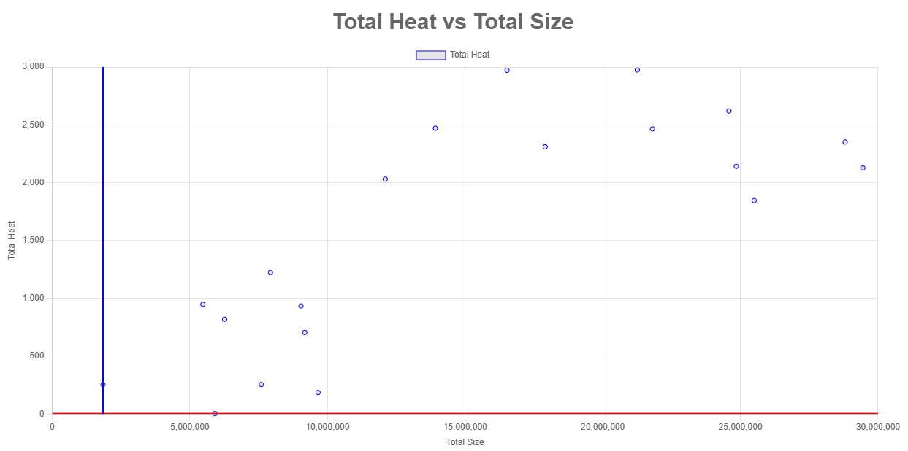
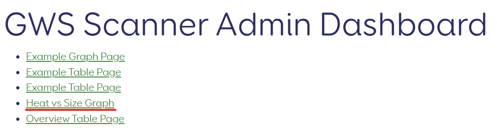
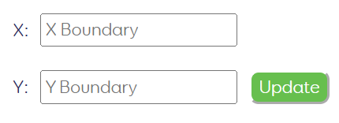

# GWS Graph Documentation

## Access
To access the graph from the homepage click on the link in the homepage reading Heat vs Size Graph

## Usage
### Limits  
Under the graph there are 2 inputs labelled X and Y.  
These dictate the position of the 2 lines on the graph with X corresponding to the vertical line and Y corresponding to the horizontal line.  
These lines can be used to see which group workspaces are above a certain heat or size

  
Once you have entered the values you want, click update to move the lines to the specified position.
### Other Features  
You can hover over each point to see the exact values and the origin of that data point.